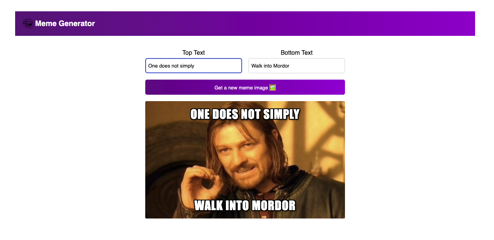

# 🖼️ Meme Generator (React)

This is a fun and interactive Meme Generator built with React. It allows users to generate random meme images and overlay custom top and bottom text. The project was created to practice using the `useEffect` hook and working with data fetching in React functional components.

## 🧠 What I Practiced

- Using the `useEffect` hook for side effects.
- Fetching and handling API data in React.
- Managing component state with `useState`.
- Handling user input and dynamic rendering.

## ⚙️ Features

- Fetches a list of meme templates from an external API.
- Displays a random meme image on button click.
- Lets users add custom top and bottom text.
- Dynamically updates the meme preview.

## 🔗 Live Demo

https://meme-generator-react-ten.vercel.app/

## 🚀 Getting Started

### Prerequisites

- Node.js and npm installed on your machine.

### Installation

1. Clone the repository:

   ```bash
   git clone https://github.com/wesleyajavon/meme-generator-react.git
   cd meme-generator-react
   npm install
   npm run dev 

## 📸 Preview

